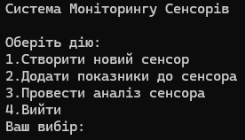

# Система Моніторингу Сенсорів

Простий консольний додаток на c++ для моніторингу та базового аналізу показників з сенсорів.

## Скріншот

## Основні функції

* **Управління сенсорами:** Створення нових сенсорів та додавання їх до `sensorhub`.
* **Збір даних:** Можливість додавати нові показники типу `double` до обраного сенсора.
* **Базовий аналіз:**
    * Розрахунок мінімального `getmin` та максимального `getmax` значення.
* **Аналіз даних:**
    * Розрахунок ковзного середнього `getslidingaverage` з заданим розміром "вікна" $k$.
    * Виявлення сплесків `detectspikes` – значень, що перевищують заданий поріг.
* **Обробка помилок:** Використання власних класів винятків `sensornotfoundexception`, `invalidconfigurationexception`.