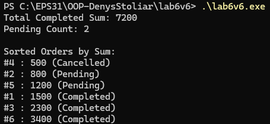

# абораторна робота №6 - варіант 6

## опис

ця програма реалізує обробку колекції замовлень `Order` (id, сума, статус) з використанням лямбда-виразів та алгоритмів STL

у програмі виконуються такі операції:
- підрахунок загальної суми замовлень зі статусом **Completed**
- визначення кількості замовлень зі статусом **Pending**
- сортування всіх замовлень за сумою
- виведення результатів у консоль

## як це працює

- для обчислення загальної суми використовується `std::accumulate` з лямбда-функцією
- для підрахунку кількості Pending застосовується `std::count_if`
- для сортування колекції використовується `std::sort` з лямбда-компаратором
- усі дії виконуються без додаткових циклів — виключно через стандартні алгоритми STL

## приклад роботи програми



## запуск

скомпілювати за допомогою будь-якого компілятора C++:

```bash
g++ main.cpp -o lab6
./lab6