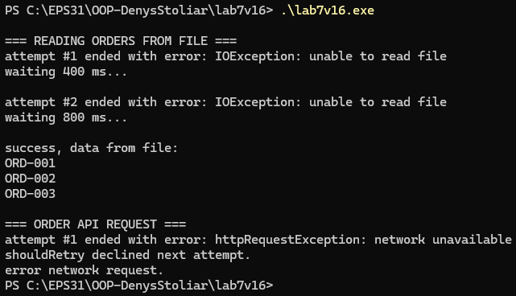

# лабораторн аробота №7 
### варіант №16

## Опис
цей проєкт демонструє обробку IO/мережевих помилок та реалізацію патерну **Retry**

у програмі реалізовані:
- `FileProcessor` - імітує читання замовлень з файлу та генерує `IOException` перші 2 рази
- `NetworkClient` - імітує отримання замовлень з API та генерує `HttpRequestException` перші 3 рази
- `RetryHelper` - універсальний механізм повторних спроб з експоненційною затримкою та логуванням

## як це воркінг
1. **FileProcessor** перші 2 виклики кидає штучну помилку, після чого повертає список замовлень
2. **NetworkClient** перші 3 виклики імітує мережеву помилку, потім повертає правильні дані
3. **RetryHelper** повторює виконання операції кілька разів:
   - виводить інформацію про помилки
   - робить експоненційні затримки (0.4 с. -> 0.8 с. -> 1.6 с. -> …)
   - використовує `shouldRetry` для вибору, чи можна повторювати спробу

## приклад роботи програми  



## як запустити
```bash
g++ lab7v16.cpp -o lab7v16.exe
./lab7v16.exe