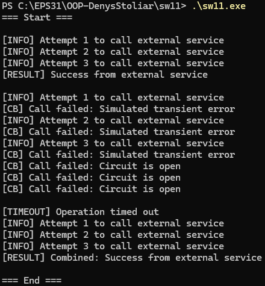

# SW №11

реалізовано власну мікробібліотеку **polly.hpp**, що імітує базові політики Polly

---

# сценарій 1 - виклик зовнішнього API, яке може тимчасово бути недоступним

### проблема

зовнішнє API може тимчасово повертати помилки. короткочасні збої не повинні призводити до повного падіння системи

### обрана політика

**retry зі збільшенням затримки**

### логування

кожна спроба виводиться в консоль:

```
[INFO] Attempt 1 to call external service
[INFO] Attempt 2...
```

---

# сценарій 2 - система має часті збої, які можуть перерости у лавинні помилки

### проблема

якщо сервіс постійно падає, нескінченні або часті виклики лише погіршать ситуацію

### обрана політика

**circuit breaker з порогом помилок**

### імітація

сервіс кидає 5 помилок поспіль.
CircuitBreaker налаштований на поріг 3.

Після 3 помилок CB відкривається:

```
[CB] Call failed: Circuit is open
```

---

# сценарій 3 — операція, що може зависати

### проблема

Функція може працювати занадто довго (вічне очікування, зависання зовнішнього сервісу).
Потрібно обмежити максимальний час виконання.

### обрана політика

**timeout.**

# приклад результату виконання

