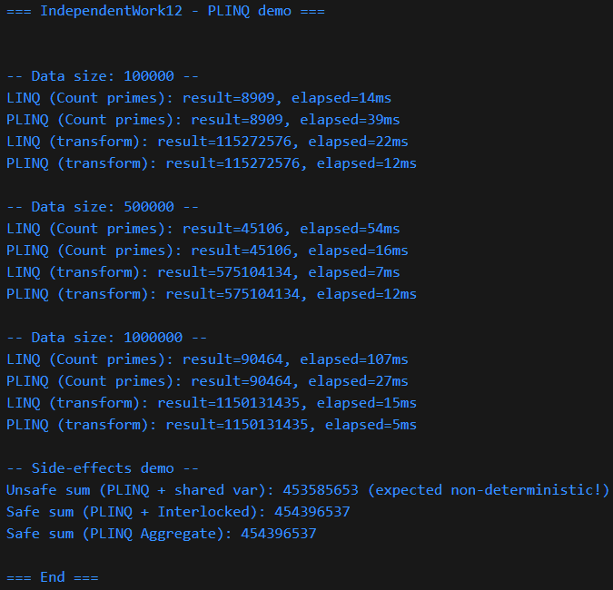

# SW №12

# 1. порівняння linq та plinq у задачі пошуку простих чисел

для вирішення використано plinq (`asparallel()`), що дозволяє розподілити обчислення між кількома потоками

приклад результату:

```
linq (count primes): result=90464, elapsed=110ms
plinq (count primes): result=90464, elapsed=29ms
```

---

# 2. паралельні трансформації даних

математичні операції, такі як log та sqrt, навантажують процесор, особливо при великій кількості елементів

приклад результату:

```
linq (transform): result=1150131435, elapsed=15ms
plinq (transform): result=1150131435, elapsed=3ms
```

---

# 3. побічні ефекти у plinq

при використанні спільної змінної в паралельних обчисленнях виникає race condition, що призводить до неправильних та нестабільних результатів

некоректний приклад:

```
unsafe sum (plinq + shared var): 454048912
```

коректні підходи виконані через `interlocked.add` та метод `aggregate`, що дозволяють уникнути проблем конкурентності

```
safe sum (interlocked): 454396537
safe sum (aggregate): 454396537
```

---

# приклад виводу програми

